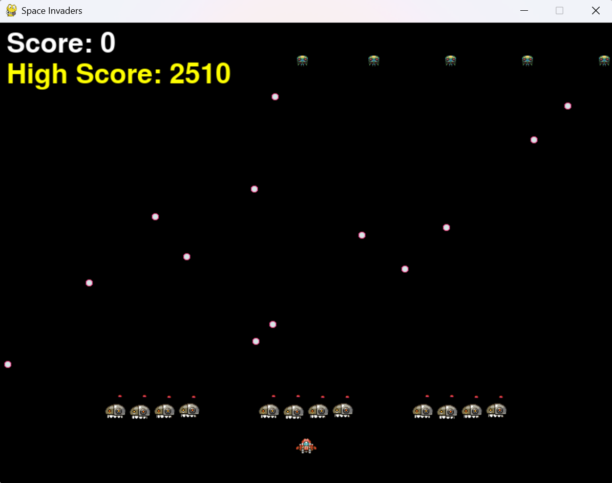
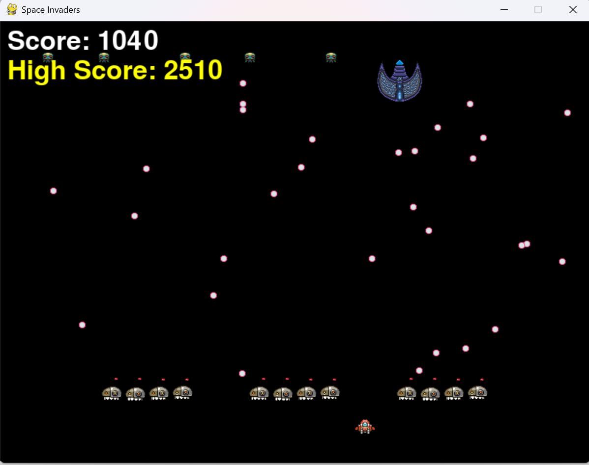
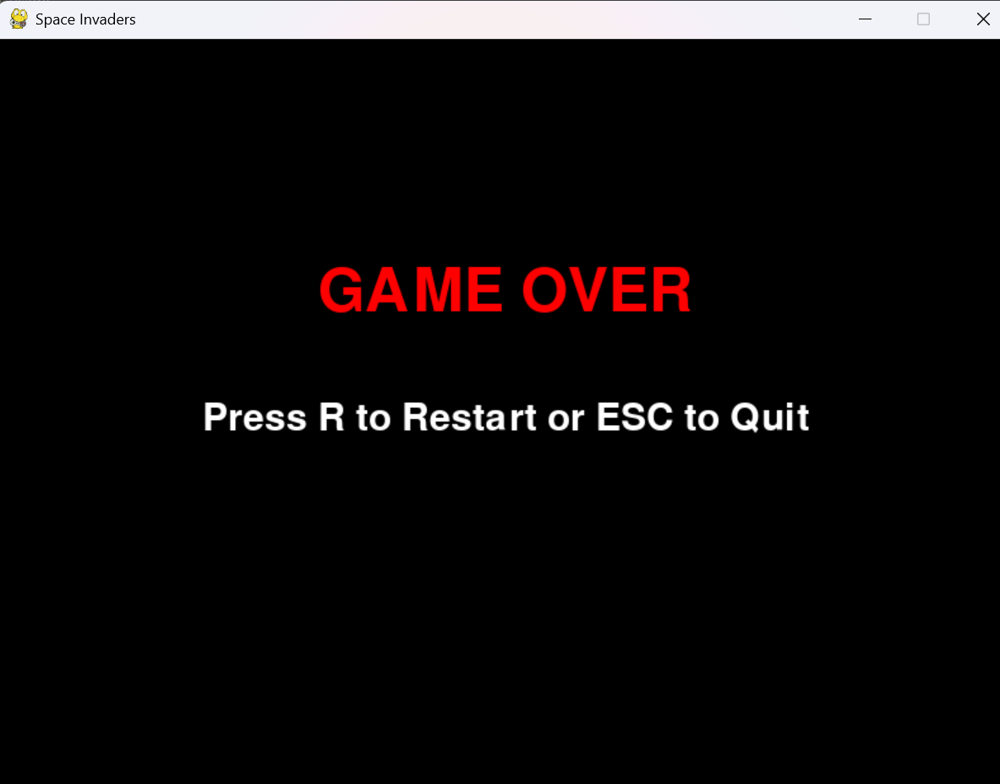

# Space Invaders - Python Game

## 📌 프로젝트 개요
Python과 Pygame을 활용하여 만든 "Space Invaders" 게임입니다.
적을 처치하고 최고 점수를 갱신하면서 난이도가 점진적으로 증가하는 슈팅 게임입니다.

## 🎮 게임 플레이 방법
1. `←` / `→` 키: 플레이어 이동
2. `SPACE` 키: 미사일 발사
3. 적을 처치하고 점수를 획득하세요.
4. UFO를 맞추면 추가 점수를 획득할 수 있습니다.
5. 적의 미사일에 맞거나 모든 적이 화면 아래로 도달하면 게임 오버됩니다.

## 🛠 기술 스택
- **언어**: Python 3.x
- **라이브러리**: Pygame
- **배포 환경**: Docker
- **버전 관리**: Git, GitHub

## ⚙ 시스템 요구 사항
- Python 3.13+
- Pygame 2.6.1


## 🏗 프로젝트 구조
```
SpaceInvaders/
├── assets/                # 게임 리소스 (이미지, 사운드 등)
│   ├── images/            # 게임 내 이미지 파일
│   ├── sounds/            # 배경 음악 및 효과음
│
├── build/                 # 빌드 관련 파일
│   ├── description.txt    # 빌드 설명 파일
│
├── data/                  # 게임 데이터 저장소
│   ├── highscore.txt      # 최고 점수 저장 파일
│
├── src/                   # 게임 소스 코드
│   ├── barrier.py         # 방어막 관련 로직
│   ├── bullet.py          # 미사일 관련 로직
│   ├── enemy.py           # 적 캐릭터 로직
│   ├── enemy_bullet.py    # 적 미사일 로직
│   ├── explosion.py       # 폭발 효과 처리
│   ├── game_manager.py    # 게임 관리 로직
│   ├── main.py            # 메인 실행 파일
│   ├── player.py          # 플레이어 캐릭터 로직
│   ├── settings.py        # 게임 설정 파일
│   ├── ufo.py             # UFO 적 로직
│
├── .gitignore             # Git 무시 파일 목록
├── README.md              # 프로젝트 설명 파일
├── requirements.txt       # Python 의존성 목록
├── Dockerfile             # Docker 컨테이너 설정 파일
├── docker-compose.yml     # Docker 실행 설정 파일
```

## 🚀 설치 및 실행 방법
### 1️⃣ 로컬 환경 실행 (Python 직접 실행)
```sh
# 1. 프로젝트 클론
git clone https://github.com/JELKOV/SpaceInvaders_by_Python.git
cd SpaceInvaders_by_Python

# 2. 가상 환경 설정 및 패키지 설치
python -m venv venv
source venv/bin/activate  # (Windows: venv\Scripts\activate)
pip install -r requirements.txt

# 3. 게임 실행
python src/main.py
```

### 2️⃣ Docker 실행 방법
```sh
# 1. Docker 이미지 빌드
docker build -t space-invaders .

# 2. 컨테이너 실행
docker run --rm -it space-invaders
```

### 3️⃣ Docker Compose 실행 방법
```sh
docker-compose up --build
```

## 🎵 사운드 및 리소스
- `assets/sounds/background.mp3` - 배경 음악
- `assets/sounds/bullet.mp3` - 미사일 발사 효과음
- `assets/sounds/explosion.mp3` - 적이 격추될 때 효과음
- `assets/sounds/ufo.mp3` - UFO 등장 효과음

## 🎯 기능 개선 사항
- [x] 적 이동 속도 증가 방식 개선
- [x] 적 미사일 발사 확률 조정 
- [x] 스테이지 전환 시 화면 깜빡임 및 메시지 표시 추가
- [x] UFO 격추 시 시각 효과 및 점수 표시 적용
- [x] 최고 점수 기록 기능 추가
- [x] Docker 배포 구성 완료

## 🖼️ 게임 스크린샷
### ✅ 게임 플레이 중


### ✅ UFO


### ✅ 게임 오버 화면


## 👨‍💻 제작자
- **이름:** 안제호
- **GitHub:** [JELKOV](https://github.com/JELKOV)


